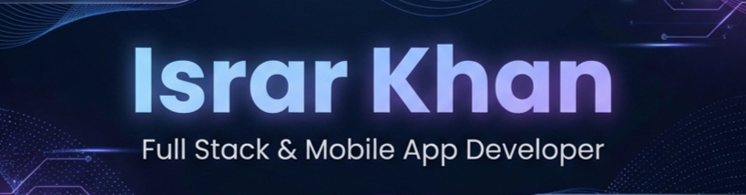

  

  

  
  
  
  
  

 

  <h2>⚡ Mission Status</h2>
  

 

  <table>
    <tr>
      <td valign="top" width="55%">
        <h3>👨‍💻 Identity Matrix</h3>

<pre><code class="language-js">
const israr_khan = {
  current_mission: ["SAID", "Antematter"],
  exploring: ["Web3", "Blockchain", "Smart Contracts"],
  tech_stack: ["React Native", "Next.js", "Node.js"],
  location: "Remote / Worldwide",
  expertise: ["Mobile Arch", "UX", "Scaling"],
  contact: "+92-347-5270640"
};
</code></pre>

      </td>

      <td valign="top" width="45%">
        <h3>🔥 Persistence Log</h3>
        

          
        

      </td>
    </tr>

  </table>

 

  <h2>💻 Battle Station</h2>
   
   
  

 

  <h2>📊 Performance</h2>
  
  

 

  
   
  

