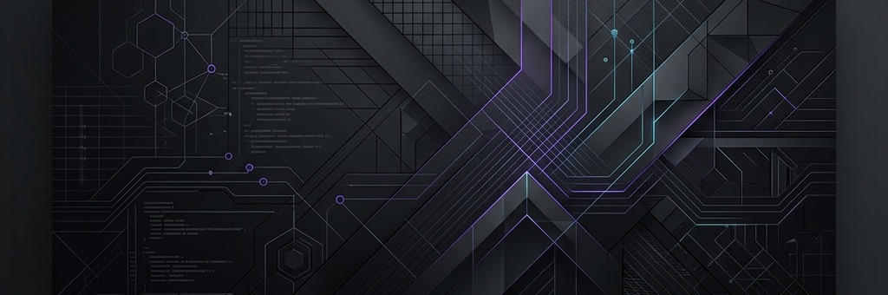

  

  <h1>Israr Khan</h1>
  
<b>Senior Mobile Engineer | Offline-First Systems | On-Device AI Specialist</b>

  

    <a href="https://linkedin.com/in/israromar">LinkedIn</a> • 
    <a href="https://github.com/israromar">GitHub</a> • 
    <a href="mailto:iisraromar@gmail.com">Email</a>
  

---

### 💡 Executive Summary

Senior Mobile Engineer with **6+ years of experience** building scalable, production-grade applications used by thousands. My engineering philosophy centers on **Privacy-Preserving AI** and **Offline-First Architectures**, specialized in bridging the gap between high-performance mobile UX and complex on-device computation.

### 🛠 Core Competencies

- **Mobile Architecture**: Expert implementation of React Native and Expo ecosystems; specialized in modular, performant cross-platform design.
- **On-Device AI & ML**: Real-world integration of LLMs (Qwen, Meta NLLB) for local inference using `onnxruntime`, eliminating cloud dependency for sensitive data.
- **System Engineering**: Architecting end-to-end features spanning robust ingestion pipelines (FastAPI), real-time layers (WebSockets), and distributed data consistency.
- **Strategic Leadership**: Experienced Team Lead (5+ engineers), standardizing frontend patterns and managing agile delivery in remote, cross-functional environments.

---

### 🚀 Selected Technical Impact

#### **Antematter (LOOT8)** | _Senior Software Engineer_

_Web3 Mobile Platform & AI Translation System_

- Developed a privacy-first, **offline-ready AI translation system** using local LLM inference (Qwen/NLLB), ensuring 100% cloud-independent processing.
- Scaled React Native features for a high-traffic Web3 ecosystem, managing complex blockchain interactions via Ethers.js and GraphQL.
- **Key Wins**: Improved system reliability and data consistency through rigorous API contract design and architectural standardization.

#### **SAID Translations** | _Open Source / Pilot_

_Medical-Grade Offline Translation Engine_

- Engineered a specialized translation system for sensitive medical environments where data privacy and offline capability are non-negotiable.
- Optimized local model performance using the ONNX ecosystem for mobile-optimized inference.
- **Stack**: React Native, onnxruntime, Meta NLLB.

#### **Lawgbook** | _AI Lead_

_Intelligent Legal Billing Automation_

- Architected a FastAPI-driven ingestion pipeline processing high-volume activity data from various communication hooks.
- Implemented a multi-provider LLM workflow (OpenRouter + OpenCode) with structured tracing for activity-to-entity classification.
- **Stack**: Python, FastAPI, PostgreSQL, LLM Orchestration.

---

### 💻 Technical Ecosystem

<table>
  <tr>
    <td width="33%" valign="top">
      <b>Mobile & Core</b> 
      • React Native / Expo 
      • Redux / Zustand 
      • Ethers.js / Web3Auth
    </td>
    <td width="33%" valign="top">
      <b>Web & Backend</b> 
      • Next.js / React.js 
      • Node.js / NestJS 
      • FastAPI / Python 
      • GraphQL (Apollo)
    </td>
    <td width="33%" valign="top">
      <b>Data & Infra</b> 
      • PostgreSQL / MongoDB 
      • Firebase / AWS 
      • Docker / Fastlane 
      • ONNX / Local Inference
    </td>
  </tr>
</table>

---

  Senior-level engineering is about reducing complexity, ensuring privacy, and building for the long term.

